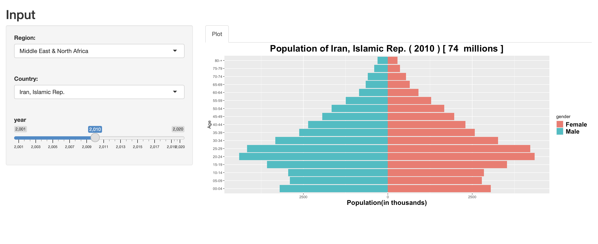

## Introduction
In this demo, I want to plot the age demographics of different countries around the world.
I'm getting the data from [The World Bank](https://www.worldbank.org/en/home) using this [API](https://github.com/gshs-ornl/wbstats)


## Packages

```r
library(wbstats)
library(tidyverse)
library(ggplot2)
wb_search("population ages.*male")[1:5, ]
```

```
## # A tibble: 5 × 3
##   indicator_id         indicator                                  indicator_desc
##   <chr>                <chr>                                      <chr>         
## 1 SH.CON.1524.FE.ZS    Condom use, population ages 15-24, female… Condom use, f…
## 2 SH.CON.1524.MA.ZS    Condom use, population ages 15-24, male (… Condom use, m…
## 3 SL.TLF.CACT.FM.NE.ZS Ratio of female to male labor force parti… Labor force p…
## 4 SL.TLF.CACT.FM.ZS    Ratio of female to male labor force parti… Labor force p…
## 5 SP.POP.0004.FE       Population ages 00-04, female              Female popula…
```


```r
# array of ["SP.POP.0004.FE" .. "SP.POP.2024.MA" .. ]
indicators <- paste(rep(
    c(
        "SP.POP.0004", "SP.POP.0509",
        paste("SP.POP.", 5 * c(2:15), 5 * c(2:15) + 4, sep = ""),
        "SP.POP.80UP"
    ), 2
), c(".FE", ".MA"), sep = "")

```
This app will generate something like this
